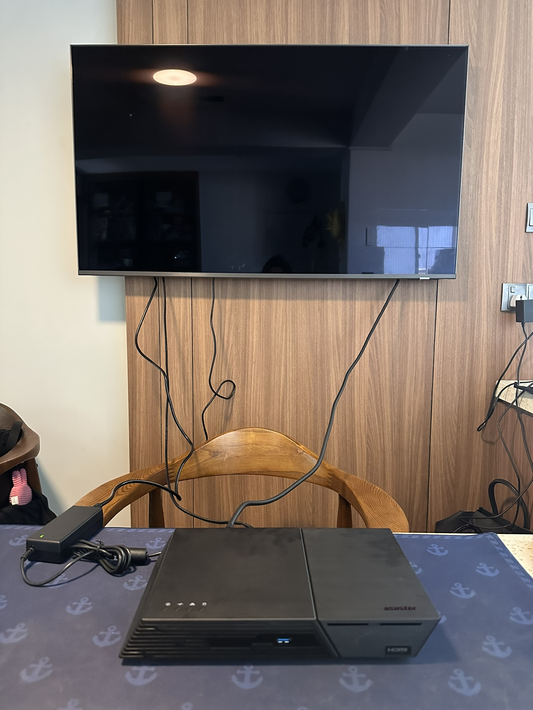
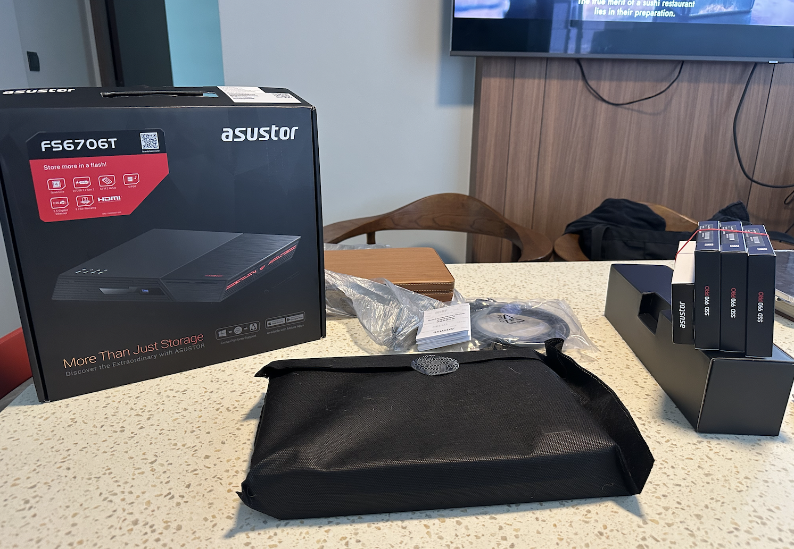
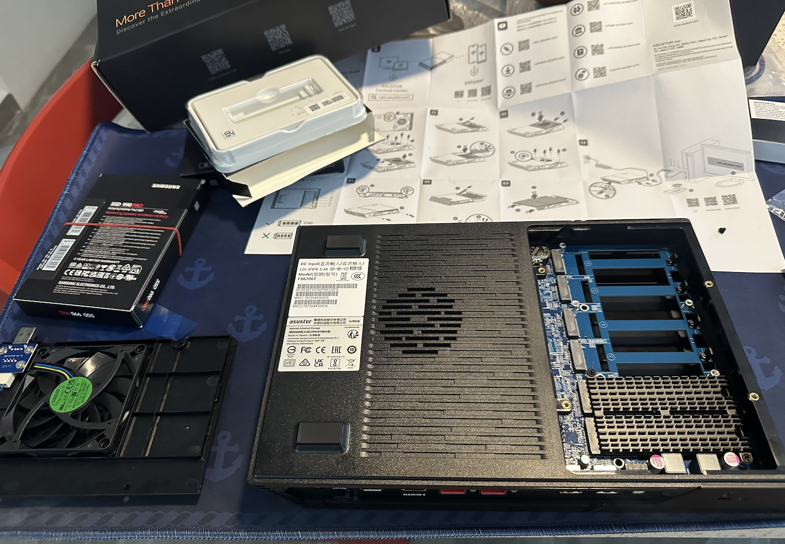
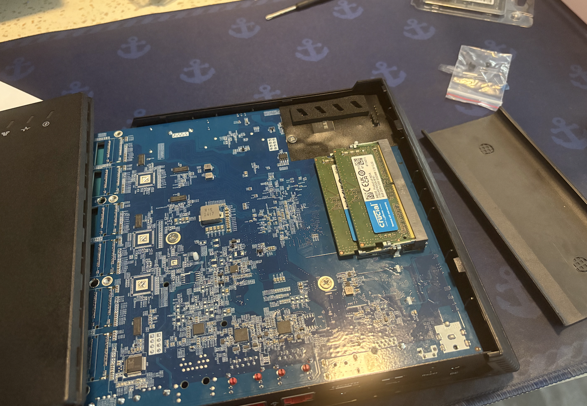
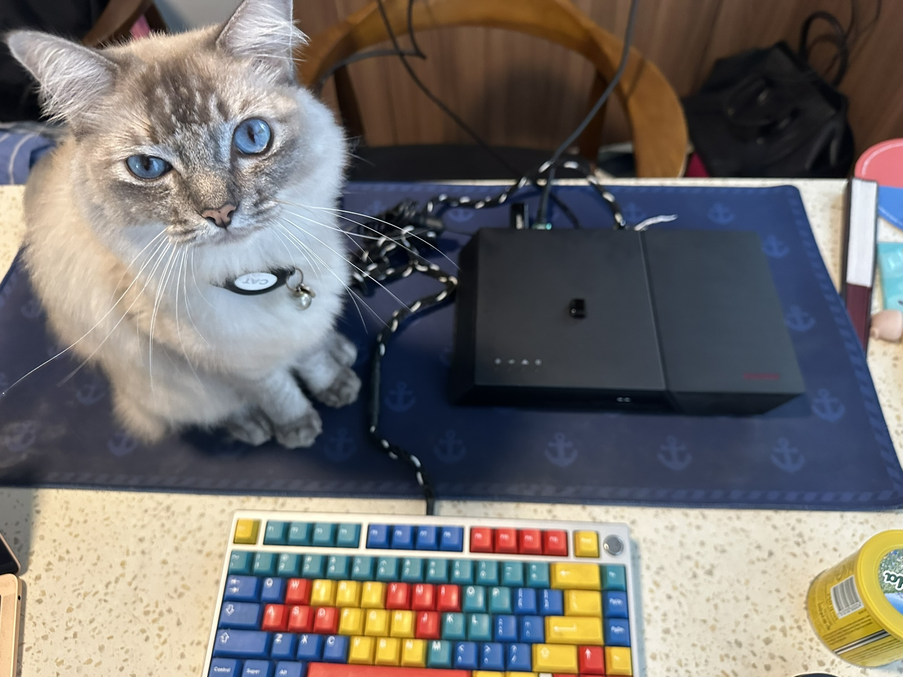
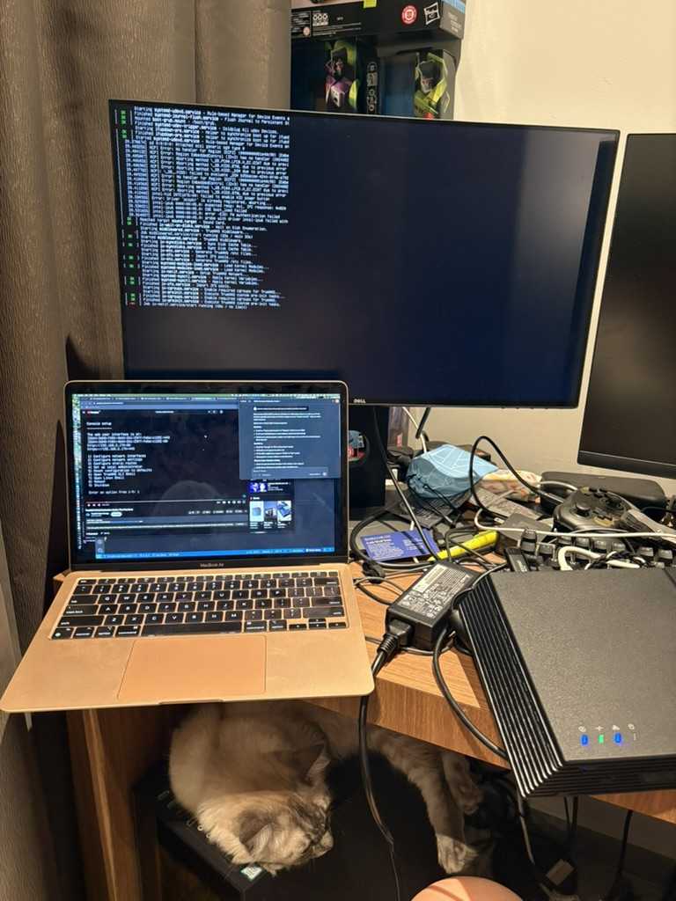
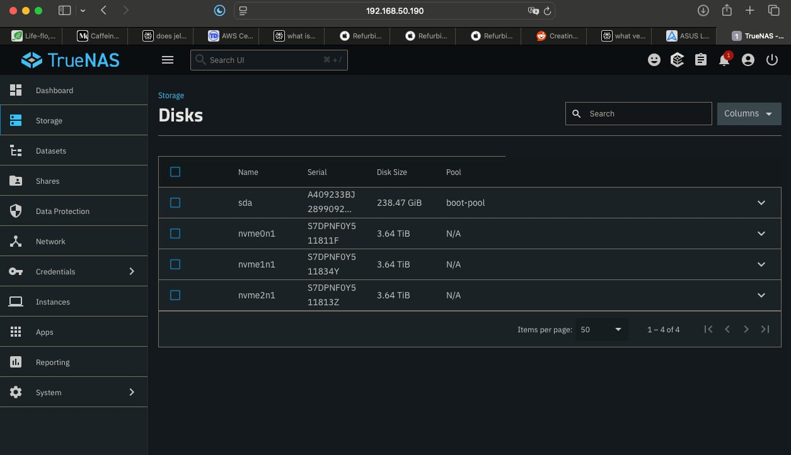

# plashtor 6 jokes just write themselves in july 2025

[i am now the dude in this video i guess](https://www.youtube.com/watch?v=Q591qHMJgSI)

i mean...

## build the nas

## truenas scale

downloads - https://download.truenas.com, i got latest stable distribution [fangtooth](https://download.truenas.com/TrueNAS-Fangtooth/25.04.0/TrueNAS-SCALE-25.04.0.iso)

## boot issue

dead cmos battery - https://www.youtube.com/shorts/6RfYElBbSJo

## bios

[asus truenas scale installation video guide](https://www.youtube.com/watch?v=YytWFtgqVy0&t=156s)

note: 
* use f5/f6 to change priority of boot drives
* looks like i might have one dead ssd.... urgh 
* NO IT WAS JUST A SKILL ISSUE ABOUT INSTALLATION
* why is this so much harder than even mechanical keyboards, you would think those are good practice

[first boot](https://www.youtube.com/watch?v=PCrwwiXDsz4) video and [some guy talking through the installation as well](https://www.youtube.com/watch?v=67KtKoW4IM0&t=304s)

## success

## to do 

https://wiki.serversatho.me/TrueNAS

also to figure out how to use zfs with my existing k3s cluster / utilise the nas k3s cluster as well